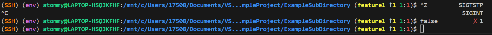

# My shell configuration
I use WSL-Ubuntu-bash.
The provided .bashrc file adds the following modifications and functionality to the terminal:
- The terminal will print **SIGINT** and **SIGTSTP** when you press Ctrl + C and Ctrl + Z respectively.
- If a command fails/errors, the terminal will print **✗ ${error exit status}**.
- When you are in a ssh session, an orange **(SSH)** is prepended to $PS1.  
- When you are in a virtual environment, a pink **(env)** is prepended to $PS1.
- Virtual environments will automatically be activated if there is a virtual environment in the current or parent directory, and deactivated if there's not. Virtual environment folders must be named env, venv, venv3, or .venv for this feature to work.
    - If the user manually deactivates a virtual environment, the automatic activation is disabled for the current session.
    - You can choose whether or not to automatically activate virtual environments by running **$ toggle_auto_env_activation**. I have it enabled.
- You can specify a minimum number of spaces that you want available at the end of each line in your terminal (stored in the min_spaces variable). If PS1 is so long that it'd cause the number of spaces at the end of the terminal to be less than the specified amount, the current working directory part of PS1 is truncated until the specified number of spaces are availab.e
    - The minimum number of spaces at the end of the terminal can be modified via the provided set_min_spaces function, for example: **$ set_min_spaces 30** (note: if you want to essentially disable this feature, you can provide an argument such as -1000). I have it set to 20.
- If you're in a directory with git version control, some information about the git repository is appended to $PS1.
    - This is formatted as (${branch_name} ↑${num_commits} ${num_staged_files}:${num_modified_files})
        - The number of commits is only shown if num_commits > 0.
        - The number of staged files and number of modified files is only shown if (num_staged_files > 0 || num_modified_files > 0).
    - You can choose whether or not to display git information by running **$ toggle_git_info**. I have it enabled.
- Whenever you enter a new branch, $ git fetch is automatically run to determine if there are changes in the remote repository.

