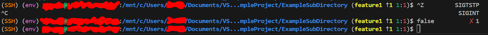

# My shell configuration
When coding I use WSL, which uses the Ubuntu Linux distro, and my terminal uses the bash shell.

The provided .bashrc file adds the following modifications and functionality to the terminal:
- The terminal will print ``SIGINT`` and ``SIGTSTP`` when you press Ctrl + C and Ctrl + Z respectively.
- If a command fails/errors, the terminal will print ``✗ ${error exit status}``.
- When you are in a ssh session, an orange ``(SSH) `` is prepended to ``$PS1``.  
- When you are in a virtual environment, a pink ``(env) `` is prepended to ``$PS1``.
- You can specify a minimum number of spaces that you want available at the end of each line in your terminal (stored in the min_spaces variable). If ``$PS1`` is so long that it'd cause the number of spaces at the end of the terminal to be less than the specified amount, the current working directory part of ``$PS1`` is truncated until the specified number of spaces are availab.e
    - The minimum number of spaces at the end of the terminal can be modified via the provided set_min_spaces function, for example: ``set_min_spaces 30`` (note: if you want to essentially disable this feature, you can provide an argument such as ``-1000``). I have it set to ``20``.
- If you're in a directory with git version control, some information about the git repository is appended to ``$PS1``.
    - This is formatted as ``(${branch_name} ↑${num_commits} ${num_staged_files}:${num_modified_files})``
        - The number of commits is only shown if ``num_commits`` > 0.
        - The number of staged files and number of modified files is only shown if (``num_staged_files`` > 0 || ``num_modified_files`` > 0) and there are no merge conflicts.
        - If there are merge conflicts, the number of merge conflicts will be displayed formatted as ``conflicts:${num_merge_conflicts}`` instead of the number of staged and modified files.
    - You can choose whether or not to display git information by running ``toggle_git_info``. I have it enabled.
- Whenever you enter a new branch, ``git fetch`` is automatically run to determine if there are changes in the associated remote repository if there is one. You'll be notified if there are any changes.
    - The reason this isn't run every time is because ``git fetch`` is a slow operation. You can choose whether or not to enable this feature by running ``toggle_auto_git_fetch``. I have it enabled. 

